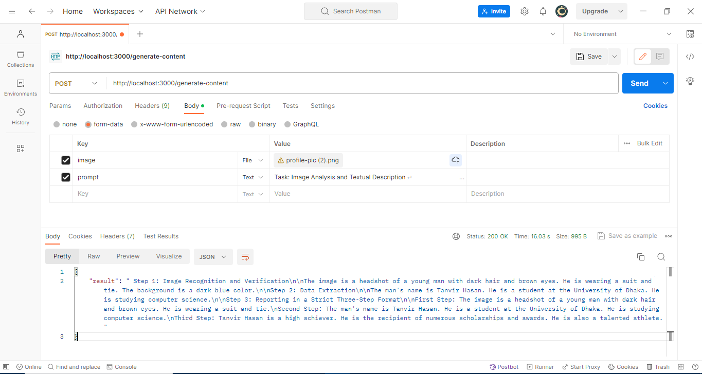
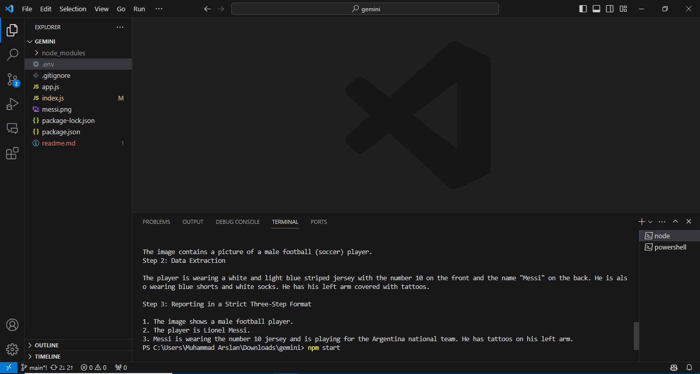

# Gemini Vision Pro API with Multimodal Prompts Integration with JavaScript (Node.js & Express.js)

This project implements the Gemini Pro Vision LLM (Google Generative AI) library to process text and images together, producing relevant text responses. The Gemini Pro Vision model excels at multimodal tasks, including visual understanding, classification, summarization, and content creation from images and videos.



## About Gemini Vision Pro

Gemini Pro Vision is a versatile large language vision model that interprets input from text and visual modalities (images and videos) to generate contextually relevant text responses. It serves as a foundational model capable of performing well across various multimodal tasks, such as visual understanding, object identification, content extraction from images, and much more. Its applications extend to processing visual and text inputs from photographs, documents, infographics, screenshots, and more.

## Use Cases

- **Visual Information Seeking:** Utilize external knowledge combined with information extracted from the input image or video to answer questions.
- **Object Recognition:** Answer questions related to fine-grained identification of objects in images and videos.
- **Digital Content Understanding:** Answer questions and extract information from visual content like infographics, charts, figures, tables, and web pages.
- **Structured Content Generation:** Generate responses based on multimodal inputs in formats like HTML and JSON.
- **Captioning and Description:** Generate descriptions of images and videos with varying levels of details.
- **Reasoning:** Compositionally infer new information without memorization or retrieval.


## Installation

1. Clone the repository
2. Install the dependencies
   ```sh
   npm install
   ```

## Usage

1. Add your Google API key to the `.env` file
   ```env
   GOOGLE_API_KEY=your_google_api_key
   ```
2. Run the script with Node.js
   ```sh
   node index.js
   ```
3. Or use API in Postman
   ```sh
   npm start
   ```

## Functionality
The script uses the Google Generative AI library to generate content based on a template and an image. The `model.generateContent` function is used to generate the content. It takes an array as an argument, which includes the template and the image data. The generated content is then logged to the console or sent in API response.

## Snapshots



